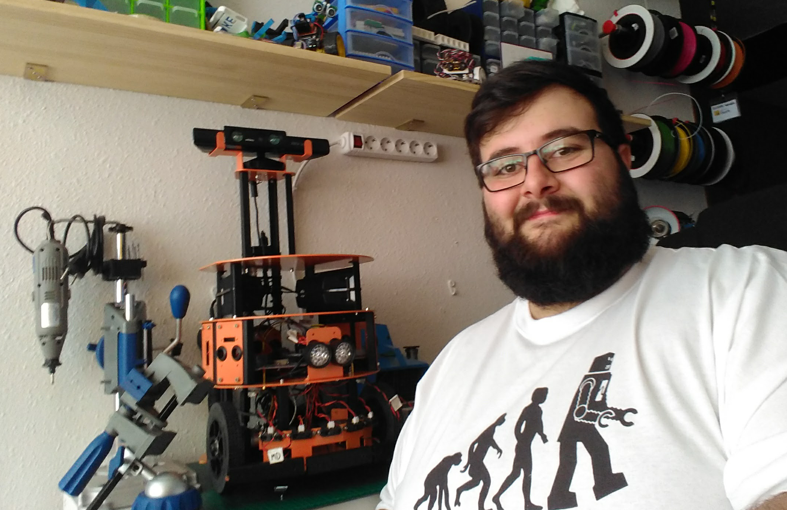
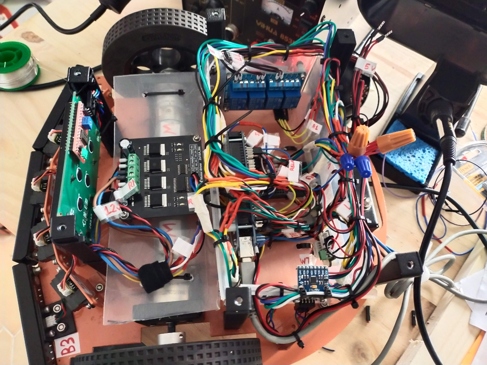

<h1 align="center">
  Charlie Robot Platform
</h1>

  HCR Mobile Robot Kit with additional electronic and controlled with Node.js

# About

HCR Mobile Robot Kit with additional electronic and controlled with Node.js

❤️ Awesome Features:

- [x] Easy integration with Node.js 🔥
- [x] Simplified way to extend and define hardware components 🍺
- [x] Great abstractions to control and group hardware components 🎉
- [x] Effective way to include modes that allow the inclusion of predefined behavior 📦
- [ ] Easy to use and great test coverage without the need of the physical hardware 👾

## Making off 💪 

In 2015, I took on a project with a mission to educate others about robotics. After accumulating a wealth of knowledge and experience, I recently made the decision to compile it all into a repository and use the leftover hardware from other projects in my homelab to build an upgraded version of this robot.

## Hardware

- 1x [HCR Mobile Robot Kit with support for Kinnect (from 2015)](https://www.dfrobot.com/product-361.html)
- 3x Collision sensor from HCR Kit
- 5x Proximity (Sharp GP2Y0A21) from HCR Kit
- 1x Piezo (Buzzer) from BQ Zum (deprecated)
- 1x BQ RGB Led from BQ Zum (deprecated)
- 2x BQ Continuous Servo from BQ Zum (deprecated)
- 1x Relay 4 channel
- 1x [2×15A DC Motor Driver (Discontinued) from HCR Kit](https://www.dfrobot.com/product-796.html)
- 2x [12V Low noise DC Motor 143RPM w/Encoder from HCR Kit](https://www.dfrobot.com/product-777.html)
- 1x LCD I2C (20 cols and 4 rows) (LCM1602)
- 1x Gyroscope (MPU6050)
- 1x BQ Temp controller (MS5611) from BQ Zum (deprecated)

## Built With

Development only:

- [Standard](https://www.npmjs.com/package/standard) - Linting
- [Jest](https://www.npmjs.com/package/jest) - Testing

Production only:

- [johnny-five](https://www.npmjs.com/package/johnny-five) - The JavaScript Robotics & IoT Platform

## Contributing

Please read [CONTRIBUTING.md](CONTRIBUTING.md) for details on our code of conduct, and the process for submitting pull requests to us.

## Versioning

We use [SemVer](http://semver.org/) for versioning. For the versions available, see the [tags on this repository](https://github.com/ulisesGascon/charlie-robot-platform/tags).

## Authors

- **Ulises Gascón** - *Initial work- - [@ulisesGascon](https://github.com/ulisesGascon)

See also the list of [contributors](https://github.com/ulisesGascon/charlie-robot-platform/contributors) who participated in this project.

## License

This project is licensed under the GNU AGPL3.0 License - see the [LICENSE.md](LICENSE.md) file for details

## Acknowledgments

- This project is under development, but you can help us to improve it! We :heart: FOSS!